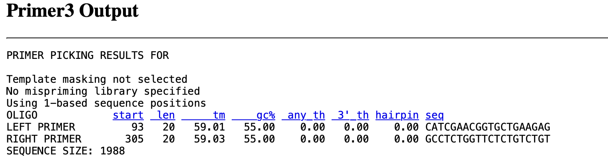

**QPCR Primer Designing Assignment**
# **Stress, Gene, Reference gene and Reason** 

**Stress: - Heat (Increasing)** 
# **Gene: - hsp70** 
It is a heat shock protein which coded and is expressed in the sea urchins due to the stress of increase in temperature. They usually express the gene to combat the stress applied on them.

**Reference Gene :- GAPd** 

This gene is used as the reference gene because it a gene which is usually not affected by the heat stress. Hence, I have selected this gene for the reference gene which is ubiquitous and housekeeping in the urchins genome.

**Reason :** 

It is a gene which is expressed only when the stress (temperature) is applied and it is not expressed in the urchins growing in the normal conditions. So, it becomes a perfect candidate. Also, the organism which didn’t undergo stress will not express this gene at all. 

**Effect :**

This gene will upregulated as the heat stress will led to temperature rise and urchins will express this gene and we will be able to quantify it. 

Steps for Primer Designing for QPCR

- So, in order to design the primers for Qpcr we will go the weblink :- <http://primer3.ut.ee/> .
- Click on pick primers and you will get the results. Make sure you recheck it with the parameters. (Primer Designing Post).
- Check for the Tm, length, hairspins and all. 
- Always run the normal PCR to validate our primer other the results will not be good and also we can’t trust the further results. 

In the context of the gene and the reference genome listed above I followed the protocols and I got the result pasted below :- 

In this way we can design the primers fore QPCR.